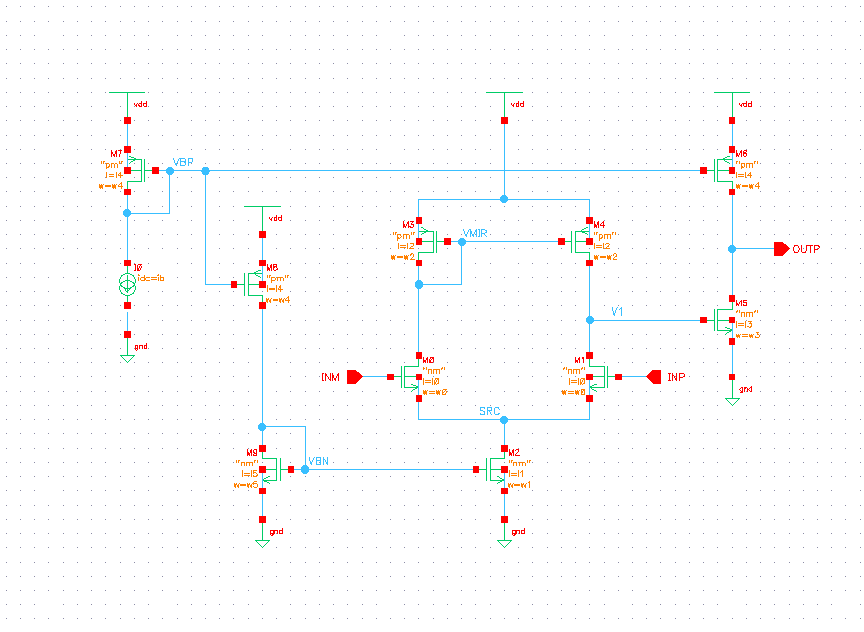

# Initiative of Reinforcement Learning for Analog Circuit Design

Vincent Liu
Last modification: March 10, 2022

## Preface

I will try to illustrate the approach of reinforcement learning applied on analog circuit design, without going into too many technical details. The goal is for the reader to have a general idea, what the problem looks like, and what approaches there might be. 

Let’s start with a basic analog circuit, a two-stage operation amplifier. Let’s limit our design to a known, working topology for now. The circuit diagram looks like this:

Target of the design is to get the unknowns of supply current, device dimensions, etc., that will meet the goal of the circuit, like gain-bandwidth, operational voltage range, and area or power constraints. 

If you take a closer look at the circuit schematic above, you'll notice there are small characters attached to the eleven devices in the diagram. There are three types of devices used in this schematic: one ideal current source, several N-type Metal-Oxide-Semiconductor (NMOS in short), and several P-type MOS (PMOS). On the left of the schematic you can find the ideal current source with a red naming of `I0`, followed by its design parameter of DC current `id`, and the variable I gave it `ib` (short for current bias). That's why you see an `id = ib` there. It is part of the design to determine what current bias `ib` should be.

For MOS there is P-type and N-type, and you can tell from the shape of the symbol. PMOS will have an arrow point into the gate oxide, and NMOS with an arrow point out of the gate oxide. For each of the MOS you'll see their labeling with model name first, which is the `nm` for NMOS and `pm` for PMOS in the circuit diagram. `nm` and `pm` are usually the Berkeley BSIM model, or EKV model that's preferred for analog design. The models will be foundry and process dependent, and would normally include the manufacturing variation in itself. Below the MOS model name is the channel length `l` and channel width `w` of the MOS device. That's the most difficult part of the design in general, to determine the channel length and width to be used. That's where you see the variables `w0`, `w1`, ...., and `l0`, `l1`, `l2`, .... etc. Every MOS had been assigned two variables for their channel width and length. In some cases two MOS would share the same width and length, to preserve their differential property of symmetry.

There are several *known* design procedures for this circuit. For years people have proposed different approaches on how to design this circuit, and they all get pretty good results. For example, the design would start from a selected bias current (the `ib` as an unknown in the circuit) from similar applications, then working on a DC solution to have all the devices biased in their saturation region. An AC and transient simulation will follow to check the gain-bandwidth and settling-time to meet the requirements. If not, the designer will work on `gm` and output resistance to achieve the design target.

The design target will be determine the values of the variable set: (`ib`, `w0`, `l0`, `w1`, `l1`, `w2`, `l2`, `w3`, `l3`, `w4`, `l4`, `w5`, `l5`), to achieve the performance requirements of the circuitry.

All of the said procedure above, will be subjected to the voltage, temperature, and the foundry process variation. It is a back-and-forth procedure to obtain the correct design parameters, to have the circuit under variations to meet the target at all times.

## Environment, Action, and Value

Real environment will be the circuit realized in silicon and put to the real world. But a SPICE simulation is in general accurate enough, and proven to be nearly identical to the real world. That makes SPICE our environment to test our design.

Each design, which is subjected to a SPICE simulation, can be considered an Action. Therefore, the action will consist of those parameters in the circuit. In our example of a two-stage operational amplifier, Action will consist of values of (`ib`, `w0`, … `w5`, `l0`, … `l5`). Those values actually complete the design, and are ready for drawing the layout and sending for manufacturing.

The **Reward** of a circuit will consist all of its functional and performance requirements. There are two kinds of requirements:

1.	A measurable quantity must not lower/higher than a certain value
2.	An advantage quantity that the highest/lowest is the best

The first one would be something like the operational amplifier must settle to 0.1% of its final value within 1&mu;s, or the gain-bandwidth-product must be above 1MHz. 

The 2nd requirement in a speed competitive application, would generally mean the operable frequency, or the frequency divided by power. If it is a cost-sensitive application, this one might be the silicon area, which can be directly evaluated from action value (w0&times;l0 + w1&times;l1 + … + w5&times;l5). Or if this is for a mobile application, the power consumption will directly link to the battery recharge cycle, and the only concern is minimizing the power.

The first kind of requirements can be implemented as an activation function like Sigmoid. If the requirement doesn’t meet, you get zero. If the requirement has been met, you get one. It doesn’t get you more value if you improve further. But the transition from zero to one might be important for the training process.

The 2nd kind of requirements would be the most important part of the **Reward** function. Say we want to optimize for the gain-bandwidth divided by power (or more specific, current), we will have a reward function looks like:

R = GBW/I&times;(those requirements in 1st catalog)

(`GBW` is a gain-bandwidth product. `I` is the total current consumption, and it will get you the power if multiplied by voltage value of `VDD`)

Let’s address two questions at this point. First question is, this problem certainly looks easy enough to be crack with brute force. Or even better, there might be an analytical solution linking the action parameters and the reward function. I do think most of the simple analog circuitry can be automated by smart programming, but this is probably exact reason to choose such problem to start with, as we can really see how the reinforcement learning do it, and hopefully there is no surprise of our stupidity that there is a better solution no one ever found yet.

2nd question: Is this learning good for anything? When the design is done, what good can the learned neural nets do? In another word, the learned weightings that's been cranked with so much processing power, can we throw away the whole inference, since the final design is already there? In general, there is foundry process migration (following Moore’s Law), and there is always new design to be done. The device models might have been changed, or there are new product improvements, say, lower power and faster speed. The target would be to have an inference, even being trained with different device models and slightly different value function, it could generate a new design in fewer effort, comparable or even better than humans. 

## Reference

1. Research in Berkeley: [AutoCkt](https://arxiv.org/pdf/2001.01808.pdf "AutoCkt: Deep Reinforcement Learning of Analog Circuit Designs")

2. Research in MIT: [Learning to Design Circuits](https://arxiv.org/pdf/1812.02734.pdf "Learning to Design Circuits")

## Resource

1. Spice model of TSMC 180nm: https://github.com/DDD-FIT-CTU/CMOS-SPICE-Model-Collections.git

Clone to the local directory, and execute the provided shell script:

    bash extractModels.sh MOSIS_waferTestData_TSMC_180nm TSMC180nm

This will give you the model file `tsmc018.m`, with two MOS `nfet` and `pfet`.

